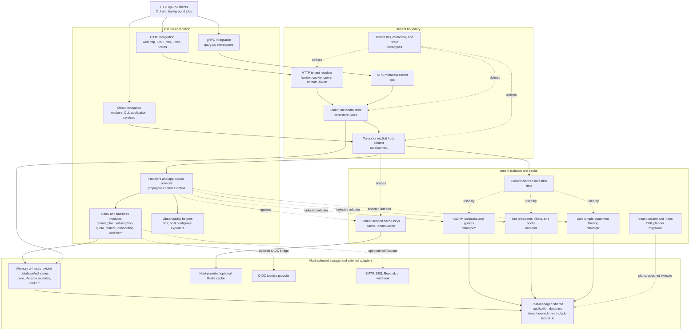
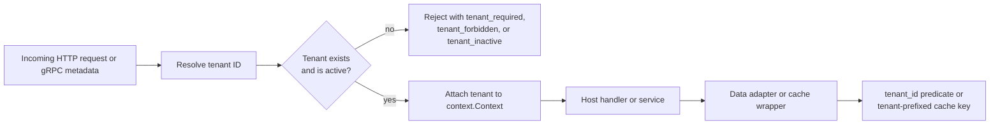

# Architecture

[EN](architecture.md) | [中文](architecture.zh-CN.md)

SaaS is a library assembled into a host Go application; it does not run an
HTTP/gRPC service or own a deployment on its own. This diagram shows the
integration boundaries implemented by the module and the normal tenant-scoped
request path. The storage and external-system nodes are selected and configured
by the host; they are supported integration points, not services deployed by
this repository.

## Tenant-scoped request path

## Boundary rules

- HTTP and gRPC integrations resolve a tenant, load its metadata, and require
  it to be active before handing control to the host application.
- `context.Context` is the scope carrier. Background work must establish a
  tenant context explicitly; host-wide work must use the deliberate
  `core/context.WithHost` path.
- The GORM, Ent, and sqlx adapters derive their data boundary from that context.
  In the shared-database model, tenant-owned rows carry `tenant_id`.
- Stores can be in-memory or use a host-provided SQL connection. Redis is an
  optional host-provided cache adapter, not the source of tenant isolation.
- `migration.Planner` generates tenant-aware DDL and seed statements; it never
  executes migrations.

See [API Reference](api.md) for the package-level surface and
[Security](security.md) for the detailed guardrail behavior.
