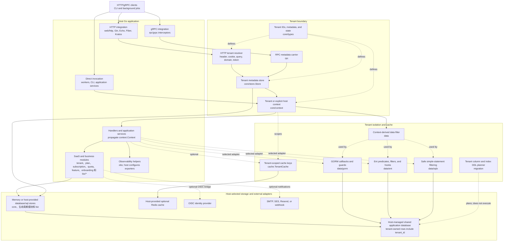
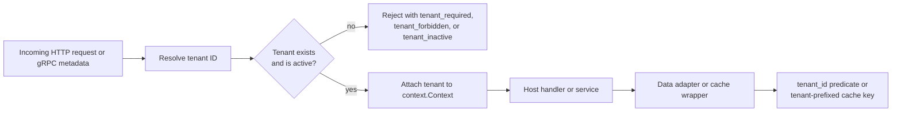

# 架构

[EN](architecture.md) | [中文](architecture.zh-CN.md)

SaaS 是一个组装到宿主 Go 应用中的库；它本身不运行 HTTP/gRPC 服务，也不独立拥有部署。本图展示了该模块实现的集成边界以及常规的租户作用域请求路径。存储和外部系统节点由宿主选择和配置；它们是受支持的集成点，而不是本仓库部署的服务。

## 租户作用域请求路径

## 边界规则

- HTTP 和 gRPC 集成会解析租户、加载其元数据，并要求租户处于活跃状态，之后才将控制权交给宿主应用。
- `context.Context` 是作用域载体。后台任务必须显式建立租户上下文；全局主机操作必须使用有意为之的 `core/context.WithHost` 路径。
- GORM、Ent 和 sqlx 适配器从该上下文派生数据边界。在共享数据库模型中，租户所有的行都带有 `tenant_id`。
- 存储可以使用内存实现，也可以使用宿主提供的 SQL 连接。Redis 是可选的、由宿主提供的缓存适配器，而不是租户隔离的来源。
- `migration.Planner` 生成租户感知的 DDL 和 seed 语句；它从不执行迁移。

有关包级接口，请参阅 [API 参考](api.zh-CN.md)；有关详细的防护行为，请参阅[安全性](security.zh-CN.md)。
